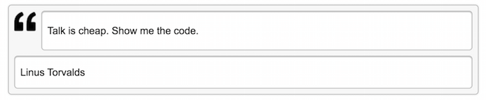

CKEditor Quotebox Button plugin for Drupal 8
-----------------------------------------

This plugin add quote formatting feature to CKEditor.

### Installation

1. Download the [QuoteBox Button](https://github.com/T1l3/Quotebox) module, put it into the modules folder, then enable it.
2. Edit selected text format where CKEditor is enabled.
3. Adjust toolbar configuration - add QuoteBox button to the toolbar.
4. Save the text format settings.
